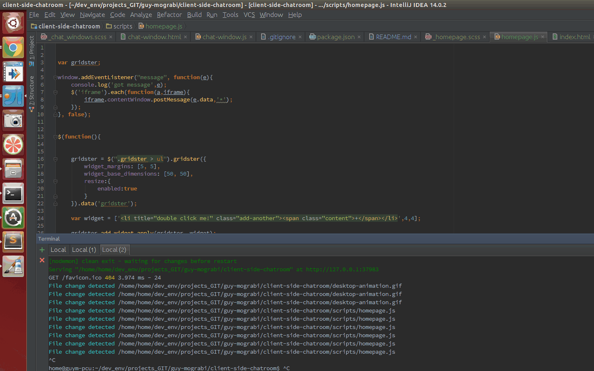

# client-side-chatroom

** make sure you have nvm installed

 - git clone https://github.com/GuyMograbi/client-side-chatroom.git && cd client-side-chatroom
 - nvm use
 - npm install -g bower && npm install && bower install
 - npm start

excuse the animated gif colors..

 
